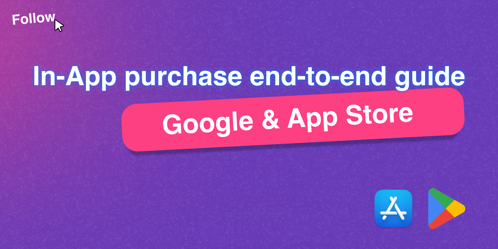

## In-App Purchase Guide

### Monetize Like a Pro: A Beginner-Friendly Guide to In-App Purchases 💰

  
 

# 📝 Features:

- Understand In-App Purchase flow with Flutter 🔄  
- Step-by-step setup for Google Play & App Store 🛠  
- Configure internal testing for smooth deployments ⚙️  
- Create & test subscription models (auto-renew & non-renew) ✅  
- Handle subscription cancellation and edge cases 🧠  
- Build once, monetize cross-platform 🌍  

# 📁 Guide Sections

- About In-App Purchase  
- Common Practices  
- Create App – Google Play  
- Google Play Internal Testing  
- In-App Products – Google Play  
- In-App Subscription – Google Play  
- Create App – App Store  
- In-App Products – App Store  
- App Store Internal Testing  
- Auto-Renewable Subscription – App Store Connect  
- Non-Renewing Subscription – App Store Connect  
- Subscription Cancellation  
- Test In-App Purchases  
- Cross Platform Compatibility  
- Keep Building 🚀  

# 📦 Made with

- Docusaurus  
- Vercel  
- Flutter  

# 🔗 Connect with me

  
  

# 🤝 Contribution

Contributions are welcome! Suggestions, improvements, or bug fixes — feel free to open an issue or submit a PR.

1. Fork this repo  
2. Create a new branch  
3. Commit your changes  
4. Push and submit a pull request  

# 📬 Contact

For bugs, ideas, or feedback, open an issue or reach me at:  
📧 avniprajapati21101@gmail.com
